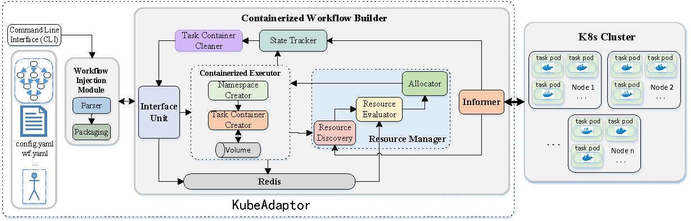
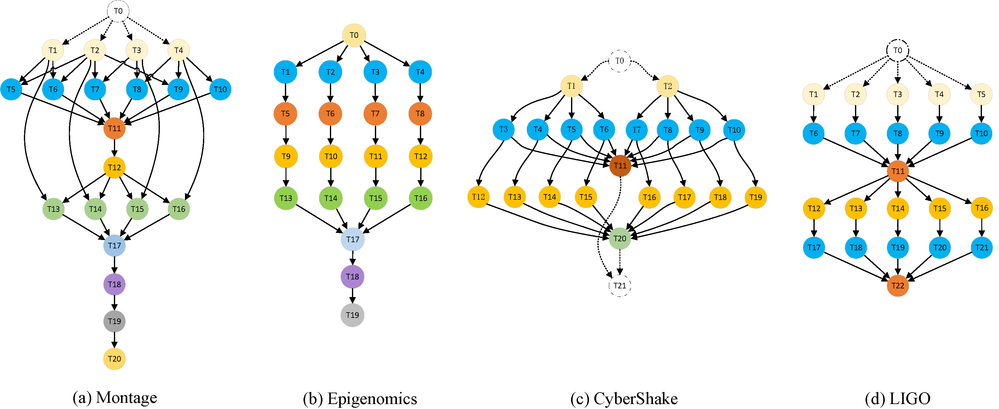

# Adaptive Resource Allocation for Workflow Containerization on Kubernetes
we propose an adaptive resource allocation scheme named `ARAS`for the Kubernetes-based workflow engines.
Considering potential future workflow task requests within the current task pod's lifecycle, the `ARAS` uses a resource 
scaling strategy to allocate resources in response to high-concurrency workflow scenarios.
The `ARAS` offers resource discovery, resource evaluation, and allocation functionalities and serves as a key component for 
our tailored workflow engine (KubeAdaptor).
`KubeAdaptor` is a docking framework able to integrate workflow systems with K8s and implement workflow
containerization on K8s clusters.
Herein, we reconstruct and extend `KubeAdaptor`, and implement `ARAS` as the `Resource Manager` component of `KubeAdaptor`, 
which consists of a `Resource Discovery` module, `Resource Evaluator` module, and `Allocator` module.
Three modules complement each other to achieve the adaptive resource allocation.
By integrating the `ARAS` into `KubeAdaptor` for workflow containerized execution, we demonstrate the practical abilities of 
KubeAdaptor and the advantages of our ARAS.

We welcome you to download, learn, and work together to maintain the `KubeAdaptor` with us. If you use it for scientific research and
engineering applications, please be sure to protect the copyright and indicate authors and source.

The `KubeAdaptor` for the `ARAS` is illustrated in above figure.
As a workflow management engine, it works to administrate, schedule, and execute containerized workflow tasks.
With the assistance of the resource allocation scheme in this paper, 
`KubeAdapter` equips with the functionalities of a cloud resource management system to 
elegantly manage a potentially highly volatile cloud workflow application scenario, 
as workflow requests continuously arrive, resulting in ever-changing resource demands.

## Resource description

### ./experiment/cwb_test

This directory includes experimental deployment files. 
The users can deploy the experiments of workflow injections through `deploy.sh` and clear this 
experiments through `clear.sh`.
The `ipNode.txt` stores the whole cluster nodes' ip address and the `redisClear.sh` aims to 
clear the Redis data generated by this experiment.
These automatic script files have the ability to capture the Master IP and obtain the other nodes' IP.
When the experiment is done, you can get the `usage.txt`, `log.txt`, and `exp.txt` files 
through our designed automatic scripts `deploy.sh` and `clear.sh`.
Our experimental environment consists of one Master and six nodes. In the K8s cluster, the node name
is identified by the node's IP.

#### Software Prerequisites

1. OS version: Ubuntu 20.4/CentOS Linux release 7.8
2. Kubernetes: v1.18.6/v1.19.6
3. Docker: 18.09.6.

Note that all docker images in the following `YAML` file are publicly available on DockerHub.
In order to avoid the influence of docker image download delay, 
all Docker images need to be downloaded to each local cluster node in advance.

In addition, you need to deploy the `NFS server service` into your cluster in advance so that each node is able to
mount the Master node's shared directory.
Each node equips with an 8-core AMD EPYC 7742 2.2GHz CPU and 16GB of RAM, running Ubuntu 20.4 and K8s v1.19.6 and Docker version 18.09.6.
The Redis database~v5.0.7 is installed on the Mater node.

If you have any questions during the operation, please do not hesitate to contact `uzz_scg@163.com`.


*The picture above is the topology diagram of four real-world workflow applications.*

#### ./experiments/cwb_test/deploy

The directory `./deploy` includes the Yaml files corresponding to `KubeAdaptor`, `RBAC`, `resource usage rate`, `Nfs`, and `workflow injection module`.
We use the `Configmap` method in `Yaml` file to inject workflow information (dependency.json) into the container of the `workflow injection module`.
Refer to `./deploy/Montage.yaml.bak` for details.
Herein, the `edit.sh` takes care of edit these system configuration files.
The `Montage.yaml.bak`, `Epigenomics.yaml.bak`, `CyberShake.yaml.bak` and `LIGO.yaml.bak` contain
the definitions of system core functionality pods and four scientific workflows.


**steps:**

*1. Update the K8s nodes' ip.

  Update the `ipNode.txt` in line with your K8s cluster.

*2. Update `./deploy/$workflowName.yaml.bak`.

  Take `Montage.yaml.bak` as example, you need modify the image address of task-container-builder pod
  and workflow-injector pod according to experimental requirements. 
  ```console
  containers:
    - name: task-container-builder-ctr
      #v8.2-baseline  v9.0-adaptive resource allocation scheme (ARAS)
      image: shanchenggang/task-container-builder:v8.2
  ```
  As shown above, you can set the image address of `task-container-builder` in the light of the `baseline 
  algorithm` (v8.2).
  ```console
  containers:
    - name: workflow-injector-ctr
      #Constant v9.0, Linear v9.1, Pyramid v9.2
      image: shanchenggang/workflow-injector:v9.0
      imagePullPolicy: IfNotPresent
      #imagePullPolicy: Always
      command: [ "./workflowInjector" ]
      #total number of workflows
      args: [ "30" ]
  ```
    As for the image address of `workflow injector` pod, you have three options corresponding to 
    three different workflow arrival patterns. 
    The parameter `args` is the number of workflow requests injected by the users. 
    ```console
    data:
      #task number in one workflow
      task.numbers: "21"
      redis.server: 0.0.0.0
      redis.port: "6379"
      #quantity per batch in Constant Arrival Pattern
      batch.num: "5"
      #time interval (seconds)
      interval.time: "300"
      #slope in Linear or Pyramid Pattern
      slope.value: "2"
      #initial value in Linear or Pyramid Pattern
      initial.value: "2"
    ```
    The `task.numbers` indicates the total task number of such workflow type, and `batch.num` indicates the number 
    of workflow tasks in each batch. The `interval.time` indicates the interval of each batch.
    The `slope.value` and `initial.value` respectively represent the growth value of each batch and initial value
    under workflow linear arrival and workflow pyramid arrival patterns.
    
    You can define tasks in your workflow as shown below.
    ```console
    data:
      dependency.json: |
        {
          "0": {
              "input": [],
              "output": ["1","2","3","4"],
              "image": ["shanchenggang/task-emulator:latest"],
              "cpuNum": ["2000"],
              "memNum": ["4000"],
              "args": ["-c","1","-m","1000","-i","3"],
              "labelName": ["app"],
              "labelValue": ["task"],
              "timeout": ["5"],
              "minCpu": ["500"],
              "minMem": ["1000"]
          },
         "1": {
             "input": ["0"],
             "output": ["5","6","13"],
             "image": ["shanchenggang/task-emulator:latest"],
             "cpuNum": ["2000"],
             "memNum": ["4000"],
             "args": ["-c","1","-m","1000","-i","3"],
             "labelName": ["app"],
             "labelValue": ["task"],
             "timeout": ["6"],
             "minCpu": ["500"],
             "minMem": ["1000"]
         },
       ...
    ```
    Herein, `input` and `output` respectively indicate the ancestor and descendant tasks of the current task. 
    `image` represents the Docker Image address of this workflow task. 
    The `cpuNum` is the amount of CPU Milli cores required by the users, and `memNum` is the amount of memory capacity
    required by the users. 
    The `minCpu` and `minMem` represent a minimum of CPU and memory resources required to run the current task container, respectively.

*3. Run `./deploy.sh`

  Deploy the `KubeAdaptor` into the K8s cluster. The `./deploy/edit.sh` file firstly captures the Master's IP,
  updates the other corresponding files. Then it copies `$workflowName.yaml.bak` to `workflowInjector-Builder.yaml`.
  The `deploy.sh` file includes a series of `Kubectl` commands.
  During the workflow lifecycle, you can watch the execution states of workflow tasks. The following is the operation command.
  ```console
  kubectl get pods -A --watch -o wide
  ```
*4. Run `./clear.sh`

  When the workflow is completed, you can run the `./clear.sh` file to clean up the workflow information and obtain the log files.

*5. Run `./redisClear.sh`
  
  Finally, you need to execute `./redisClear.sh` and input `flushall` to clean up the Redis database.

### ./resourceUsage

This directory includes the source codes of the resource gathering module.
You can build the Docker image by the `Dockerfile` file or pull the image of this module from the Docker Hub.
```console
docker pull shanchenggang/resource-usage:v1.0
```
### ./TaskContainerBuilder

This directory includes the source codes of `KubeAdaptor` with `ARAS`.
You can build the Docker image by the `Dockerfile` file or pull the image of this module from Docker Hub.
```console
docker pull shanchenggang/task-container-builder:v9.0
```
### ./WorkflowInjector (ConstantArrivalPattern)

This directory includes the source codes of the workflow injection module under Constant Arrival Pattern.
You can build Docker image by `Dockerfile` file or pull the image of this module from Docker Hub.
```console
docker pull shanchenggang/workflow-injector:v9.0
```

### ./WorkflowInjector (LinearArrivalPattern)

This directory includes the source codes of the workflow injection module under Linear Arrival Pattern.
You can build Docker image by `Dockerfile` file or pull the image of this module from Docker Hub.
```console
docker pull shanchenggang/workflow-injector:v9.1
```
### ./WorkflowInjector (PyramidArrivalPattern)

This directory includes the source codes of the workflow injection module under Pyramid Arrival Pattern.
You can build Docker image by `Dockerfile` file or pull the image of this module from Docker Hub.
```console
docker pull shanchenggang/workflow-injector:v9.2
```